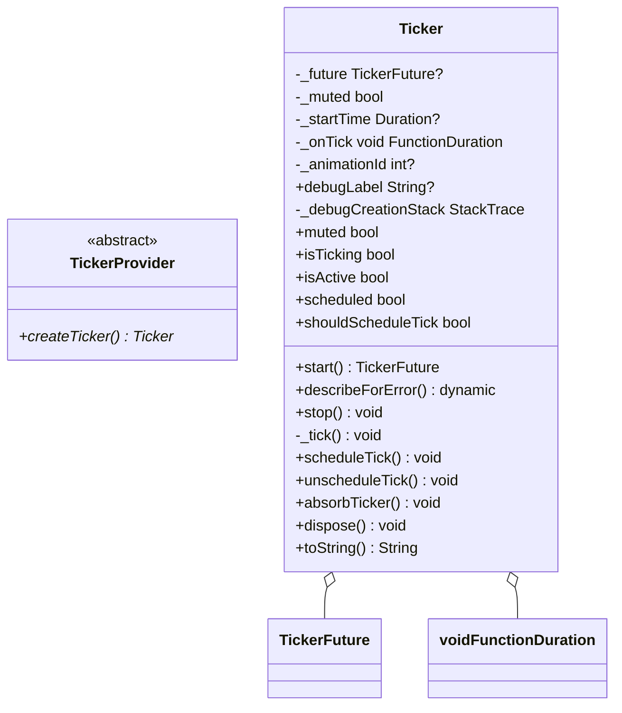

```mermaid
classDiagram
class TickerProvider
<<abstract>> TickerProvider
TickerProvider : +createTicker()* Ticker

class Ticker
Ticker : -_future TickerFuture?
Ticker o-- TickerFuture
Ticker : -_muted bool
Ticker : -_startTime Duration?
Ticker : -_onTick void FunctionDuration
Ticker o-- void FunctionDuration
Ticker : -_animationId int?
Ticker : +debugLabel String?
Ticker : -_debugCreationStack StackTrace
Ticker : +muted bool
Ticker : +isTicking bool
Ticker : +isActive bool
Ticker : +scheduled bool
Ticker : +shouldScheduleTick bool
Ticker : +start() TickerFuture
Ticker : +describeForError() dynamic
Ticker : +stop() void
Ticker : -_tick() void
Ticker : +scheduleTick() void
Ticker : +unscheduleTick() void
Ticker : +absorbTicker() void
Ticker : +dispose() void
Ticker : +toString() String
```
